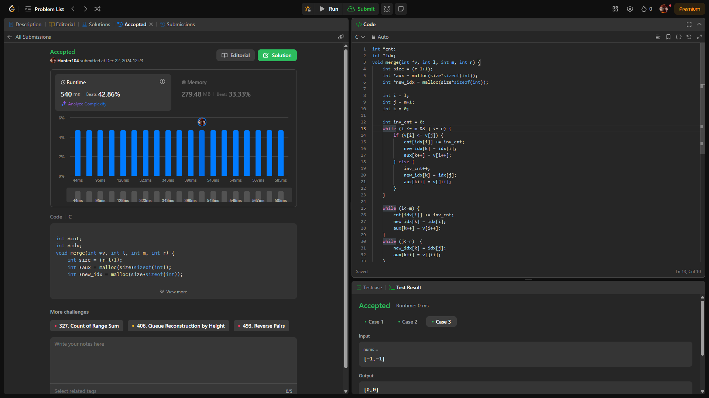
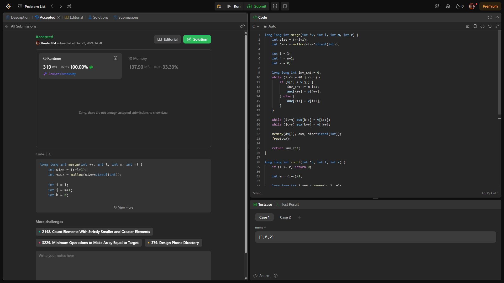

# Questões

**Número da Lista**: X 
**Conteúdo da Disciplina**: Dividir e Conquistar

## Alunos
|Matrícula | Aluno |
| -- | -- |
| 221031149  |  Danilo César Tertuliano Melo |
| 221007814  |  André Emanuel Bispo da Silva |

## Sobre 
Para esse trabalho realizamos três questões do leet code sendo duas delas difíceis e uma média. Todas as questões realizadas estavam dentro do tópico dividir e conquistar.

## Screenshots

## Outros 
Quaisquer outras informações sobre seu projeto podem ser descritas abaixo.

